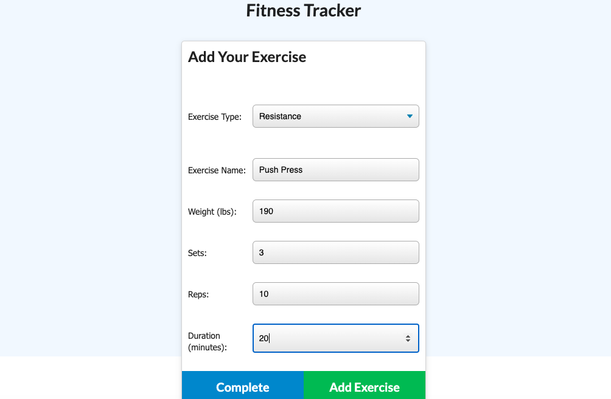

# Workout_Tracker

This is an assignment for Northwestern University Coding Bootcamp.  It consists of a workout tracker.

## Motivation

As a user, I want to be able to view, create and track daily workouts.  I want to be able to log multiple exercises on a given day.  I should also be able to track the name, type, weight, sets, reps, and duration of exercise. If the exercise is cardio, I should be able to track my distance traveled. 

## Build Status

This project is complete.

## Tech Used

This project was built with Mongo, Mongoose and Express.

## Screen Shots

## URL of deployed app

https://whispering-wildwood-92804.herokuapp.com/

## Credits

I would like to thank TA Paul Cwik and tutor Daniel Masters for their assistance and guidance in completing this project.

